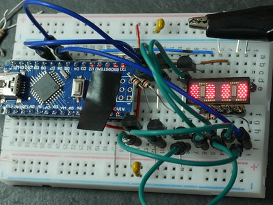
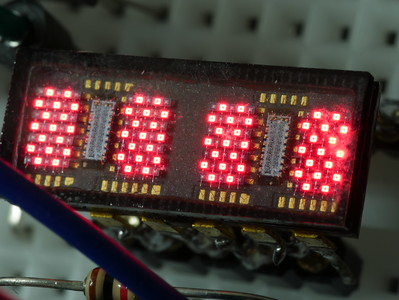

# testHDSP2000 #

Small sketch for the Arduino to display characters on an HDSP2010.
Any of the displays in the HDSP2000 series should work
(they're different colours).
This is a 5x7 matrix LED display originally made by Hewlett Packard.
It appears as a 28-bit shift register (4 digits of 7 rows each)
and 5 column driver inputs.
The columns are driven by five PNP transistors configured as high-side drivers
and connected to Arduino pins 4, 5, 6, 7, and 8.
The shift register input is connected to Arduino pin 2 and
the clock to Arduino pin 3

## Connections ##

| Name | Arduino Pin | HDSP2010 Pin |
|:-----|:------------|:-------------|
| DATA | 2           | 12           |
| CLK  | 3           | 10           |
| COL1 | 4           | 1            |
| COL2 | 5           | 2            |
| COL3 | 6           | 3            |
| COL4 | 7           | 4            |
| COL5 | 8           | 5            |
| GND  | Gnd         | 11           |
| VCC  | +5V         | 8, 9         |

## Photo of HDSP2010 on Breadboard ##

## Close-Up of HDSP2010 Display ##

